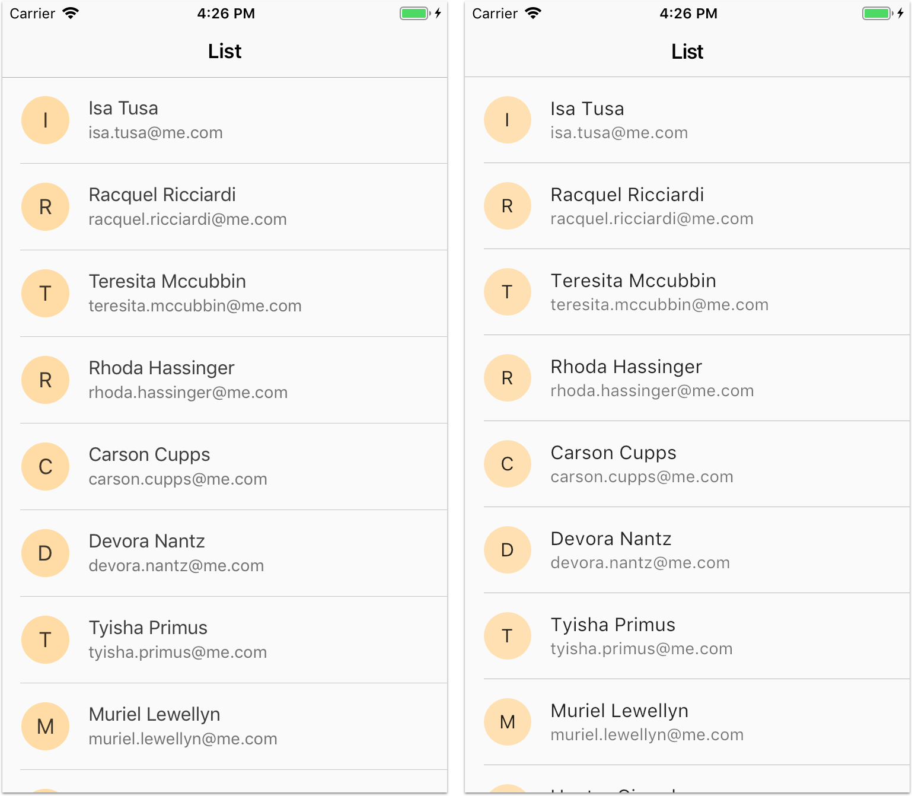

# Sample contact list page built in Flutter and iOS

This sample project shows how to build a contact list page with native iOS vs Flutter.

See my article about this here:

- [Flutter will change everything, and Apple won’t do anything about it](https://medium.com/coding-with-flutter/flutter-will-change-everything-and-apple-wont-do-anything-about-it-f495e7087802)

### Preview

### Source code

The root folder is a standart Flutter project.

The iOS project is in the `contactsListDemoIOS` folder.

### [License: MIT](LICENSE.md)